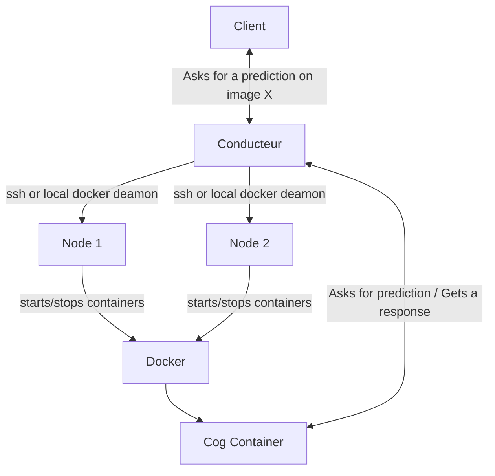

# Orchestre 

Replicate for Homelabs

Orchrestre is a small cog docker container Orchrestrator


## Features
- Multiple Nodes : You can multiple GPU host Orchrestre will load balance requests
- Scoped Token Management
- Web Dashboard
- Javascript sdk
- Co2 Monitoring


## What is Cog  ?
Cog is an API wrapper for machine learning models, its has been created and is used by Replicate for inference
Conducteur uses cog for inference


## Scoped Token Management
Scoped tokens allow you to restrict what a token can do. You can choose to allow prediction on specific docker images per usage

Observability:
Each token can be monitored in terms of co2 consumption / preductions duration / etc.


## Web Dashboard
We provide a web dashboard to

- Monitor Predictions
Get a real time view on running predictions and last 24 hours predictions.


- Monitor Nodes availability and usage
See if a Node is available and how much it's being use by running predictions

- Monitor Token usage
Get an summary of how much co2 is being used by each token for how long and on wich docker image.

- TODO Manage Tokens
Create, delete, update tokens and their scopes.

## Multiple Nodes
Orchestre allows you to run multiple nodes (A node is a physical of virtual machine with a GPU). This feature enables high throughput in the event of heavy load.


## Requirements
- A GPU Card (At least a RTX 3090 is highly recommended a lot of the cog container need at least 24 GB of VRAM)
- Docker installed on your machine
- 1To of SSD storage (Machine learnign Container are quite large and will require significant space)


## Roadmap

- CPU Inference (Already possible but only on GPU machine and only one after another)


## Architecture



Nodes are the machines that conducteur will distribute tasks on, they can be local or remote (ssh).


# HTTP API Reference

## Authentication
All request are scope based and require an API Key. This key is sent in the header of every request as Bearer Token.

## Image

## Predictions

Prediction represent an inference job waiting to be processed.or already processed with a result

Create/Delete/List Predictions

<details>
 <summary><code>POST</code> <code><b>/predict</b></code> <code>Create a new prediction</code></summary>

##### Parameters

| Name  | type     | data type | description                                      |
| ----- | -------- | --------- | ------------------------------------------------ |
| image | required | string    | The name of the cog docker image you want to use |
| input | required | object    | the input object for your cog image              |
|       |          |           |                                                  |

##### Responses

| http code | content-type               | response                                                                  |
| --------- | -------------------------- | ------------------------------------------------------------------------- |
| 200       | `application/json`         | Prediction Object                                                         |
| 403       | `text/plain;charset=UTF-8` | Not Authorized                                                            |
| 403       | `text/plain;charset=UTF-8` | The image is not within the scope of your token.                          |
| 503       | `text/plain;charset=UTF-8` | No available nodes                                                        |
| 500       | `text/plain;charset=UTF-8` | Cog setup failed with error {error message}                               |
| 403       | `text/plain;charset=UTF-8` | The health_check timed out check your container logs for more information |
| 403       | `text/plain;charset=UTF-8` | Timeout: Container {container.id} did not start within {timeout} seconds  |
| 404       | `text/plain;charset=UTF-8` | The Docker image you are trying to run does not exist.                    |
| 403       | `text/plain;charset=UTF-8` | Could not run the Docker image due to {error message}                     |


**Prediction Object**
```json
{
    "input": {
        "image": "string"
    },
    "output": "string",
    "id": null,
    "version": null,
    "created_at": null,
    "started_at": "string",
    "completed_at": "string",
    "logs": "",
    "error": null,
    "status": "string",
    "metrics": {
        "predict_time": number
    },
    "webhook": null,
    "webhook_events_filter": ["start", "output", "logs", "completed"],
    "output_file_prefix": null,
    "co2": number
}
```

**Example curl** 
```bash
curl -X POST \
  http://your-api-endpoint.com/predict \
  -H 'Content-Type: application/json' \
  -H 'Authorization: Bearer YOUR_BEARER_TOKEN' \
  -d '{"image": "your_cog_docker_image_name", "input": {"key": "value"}}'
```

</details>

<details>
 <summary><code>POST</code> <code><b>/predictions</b></code> <code>List all predictions</code></summary>

##### Parameters
None.

##### Responses
| http code | content-type       | response            |
| --------- | ------------------ | ------------------- |
| 200       | `application/json` | Predictions Objects |
|           |                    |                     |


**Prediction Objects**
```json
[
    {
        "id": number,
        "user": "string",
        "image": "string",
        "status": "string",
        "started": "string",
        "node": "string",
        "finished": "string",
        "duration": number,
        "co2": number
    }, 
    {
        "id": number,
        "user": "string",
        "image": "string",
        "status": "string",
        "started": "string",
        "node": "string",
        "finished": "string",
        "duration": number,
        "co2": number
    }, 
]
```

**Example curl**

```bash
curl -X POST \
  http://your-api-endpoint.com/predictions \
  -H 'Authorization: Bearer YOUR_API_KEY' \
  -H 'Content-Type: application/json'
```

</details>


<details>
 <summary><code>DELETE</code> <code><b>/predictions/{id}</b></code> <code>Remove a prediction by id</code></summary>

##### Responses
| http code | content-type       | response                          |
| --------- | ------------------ | --------------------------------- |
| 200       | `application/json` | {"message": "Prediction deleted"} |
| 404       | `application/json` | {"detail": "Not Found"}           |
|           |                    |                                   |


**Example curl**
```bash
curl -X DELETE \
  http://your-api-endpoint.com/predictions/12345 \
  -H 'Authorization: Bearer YOUR_API_KEY' \
  -H 'Content-Type: application/json'
```

 </details>

## User

<details>
<summary><code>POST</code> <code><b>/user</b></code> <code>Get user information based on token</code></summary>

##### Parameters
None.

##### Responses
| http code | content-type       | response     |
| --------- | ------------------ | ------------ |
| 200       | `application/json` | User Object |


**User Object**

```json
{
    "name": "string",
    "token": "string",
    "scope": ["string", "string"]
}

```

**Example curl**

```bash
curl -X POST \
  http://your-api-endpoint.com/user \
  -H 'Authorization: Bearer YOUR_API_KEY' \
  -H 'Content-Type: application/json'
```

</details>

<details>
<summary><code>POST</code>  <code><b>/user/predictions</b></code> <code>Returns all predictions made by a user.</code></summary>

##### Parameters
| Name | type     | data type | description           |
| ---- | -------- | --------- | --------------------- |
| user | required | string    | The name of the token |
|      |          |           |                       |

##### Responses
| http code | content-type       | response               |
| --------- | ------------------ | ---------------------- |
| 200       | `application/json` | User Prediction Object |
|           |                    |                        |

**User Prediction Object**
```json
{
    "total_co2": number,
    "total_duration": number,
    "predictions": [
        {
        "id": number,
        "user": "string",
        "image": "string",
        "status": "string",
        "started": "string",
        "node": "string",
        "finished": "string",
        "duration": number,
        "co2": number
        },
        {
        "id": number,
        "user": "string",
        "image": "string",
        "status": "string",
        "started": "string",
        "node": "string",
        "finished": "string",
        "duration": number,
        "co2": number
        }
```


**Example curl**
```bash
curl -X POST \
  http://your-api-endpoint.com/user/predictions \
  -H 'Authorization: Bearer YOUR_API_KEY' \
  -d '{"user": "your token name"}'
```
</details>


### Tokens

<details>
<summary><code>GET</code>  <code><b>/tokens</b></code> <code>Returns all tokens and their scopes.</code></summary>


##### Parameters
None.

##### Responses
| http code | content-type       | response     |
| --------- | ------------------ | ------------ |
| 200       | `application/json` | tokens array |
|           |                    |              |


**Tokens Array:**
```json
[
  {
    "name": "string",
    "token": "string",
    "scope": ["string","string"]
  },
  {
    "name": "string",
    "token": "string",
    "scope": ["string","string"]
  }
]
```

**Example curl**
```bash
curl -X GET \
  http://your-api-endpoint.com/tokens \
  -H 'Authorization: Bearer YOUR_API_KEY' \
  -H 'Content-Type: application/json'

```

</details>


### Cluster

Get the status of the cluster or the status of a specific node in the cluster.

<details>
<summary><code>GET</code>  <code><b>/nodes</b></code> <code>Returns all nodes and their status.</code></summary>


##### Parameters
None.

##### Responses
| http code | content-type       | response     |
| --------- | ------------------ | ------------ |
| 200       | `application/json` | Nodes array |
|           |                    |              |


**Nodes Array:**
```json
[
  {
    "name": "string",
    "host": "string",
    "weight": number,
    "state": "string"
  },
    {
    "name": "string",
    "host": "string",
    "weight": number,
    "state": "string"
  },
]
```

**Example curl**
```bash
curl -X GET \
  http://your-api-endpoint.com/nodes \
  -H 'Authorization: Bearer YOUR_API_KEY' \
  -H 'Content-Type: application/json'

```

</details>


<details>

<summary><code>GET</code>  <code><b>/status</b></code> <code>Get the cluster status</code></summary>


##### Parameters
None.

##### Responses
| http code | content-type       | response           |
| --------- | ------------------ | ------------------ |
| 200       | `application/json` | {"status": "string"} |
|           |                    |                    |

```

**Example curl**
```bash
curl -X GET \
  http://your-api-endpoint.com/status \
  -H 'Authorization: Bearer YOUR_API_KEY' \
  -H 'Content-Type: application/json'

```
</details>