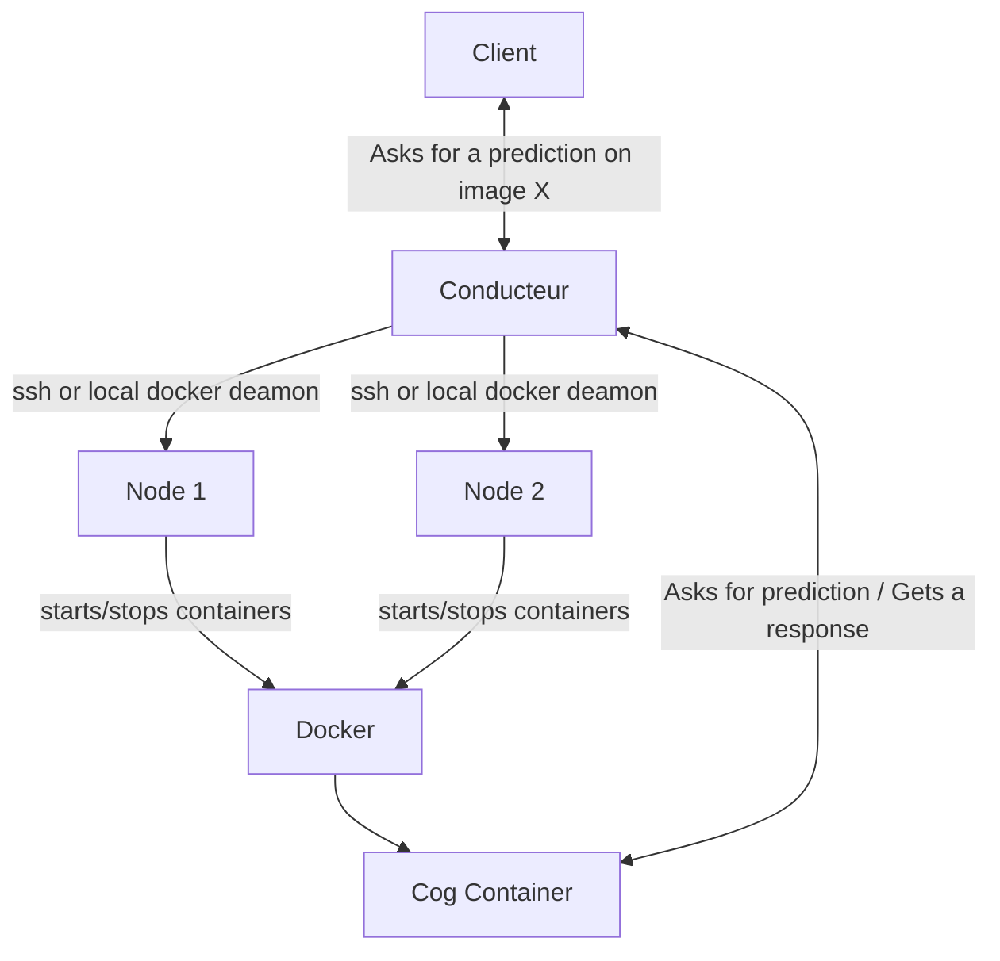

# Conducteur
Conducteur is a cog container orchestrator that uses an api to chain together gpu calculations or distribute them to other nodes. 
It monitors usage by token and manages access rights by docker image.

## Architecture



Nodes are the machines that conducteur will distribute tasks on, they can be local or remote (ssh).


## API Endpoints

| Endpoint | Method | Description |
|--- | --- | --- |
| /predict | POST   | Ask for a prediction on a cog image |
| /webhook | POST | Receive a prediction result from a cog container |
| /predictions | GET  | Get all predictions made by the user  |
| /dashboard  | GET | Get a dashboard of the user's usage and node status   |
| /tokens  | GET, PUT,POST, DELETE | Manage tokens for users or cog containers  |
| /users  | GET | Get users list |
| /users/predictions  | GET | Get a user's predictions  |
| /nodes | GET | Get nodes list |


**Authentication**: 
All endpoints are protected by JWT tokens


## Quickstart

```bash
docker run --restart=unless-stopped  -p 8080:80 -v /var/run/docker.sock:/var/run/docker.sock 
-v ./id_rsa:/root/.ssh/id_rsa yassinsiouda/conducteur
```

## FAQ

### Set docker to remote access

```bash
https://docs.docker.com/config/daemon/remote-access/
```


## Ressources
https://codestrian.com/index.php/2023/03/29/expose-rootless-docker-api-socket-via-tcp-with-ssl/